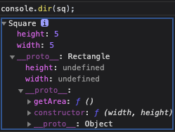
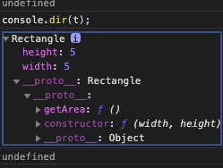

# 🌈 Chapter 7: 클래스

## 📚 클래스와 인스턴스의 개념 이해
- 클래스는 하위로 갈수록 상위 클래스의 속성을 상속하면서 더 구체적인 요건이 추가 또는 변경된다. 물론 하위 클래스가 아무리 구체화되더라도 이들을 결국 추상적인 개념일 뿐이다.
- 어떤 클래스의 속성을 지니는 실존하는 개체를 일컬어 인스턴스(instance)라고 한다.
- 어떤 클래스에 속한 개체는 그 클래스의 조건을 모두 만족하므로 그 클래스의 구체적인 예시, 즉 인스턴스가 될 것이다.
- 프로그래밍 언어에서의 클래스는 현실세계에서의 클래스와 마찬가지로 *공통 요소를 지니는 집단을 분류하기 위한 개념*이라는 측면에서는 일치하지만 인스턴스들로부터 공통점을 발견해서 클래스를 정의하는 현실과 달리, 클래스가 먼저 정의돼야만 그로부터 공통적인 요소를 지니는 개체들을 생성할 수 있다.
- 나아가 현실세계에서의 클래스는 추상적인 개념이지만, 프로그래밍 언어에서의 클래스는 사용하기에 따라 추상적인 대상일 수도 있고 구체적인 개체가 될 수도 있다.

## 📚 자바스크립트의 클래스
- 인스턴스에 상속되는지(인스턴스가 참조하는지) 여부에 따라 스태틱 멤버(static member)와 인스턴스 멤버(instance member)로 나뉜다.

```js
// 생성자
var Rectangle = function (width, height) {
  this.width = width;
  this.height = height;
};


// (프로토타입) 메서드
Rectangle.prototype.getArea = function () {
  return this.width * this.height;
};

// 스태틱 메서드
Rectangle.isRectangle = function (instance) {
  return instance instanceof Rectangle &&
    instance.width > 0 && instance.height > 0;
};

var rect1 = new Rectangle(3, 4);

console.log(rect1.getArea()); // 12
console.log(rect1.isRectangle(rect1)); // Error
console.log(Rectangle.isRectangle(rect1)); // true
```

- 프로토타입 객체에 할당한 메서드는 인스턴스가 마치 자신의 것처럼 호출할 수 있다고 했다. 그러므로 `getArea`는 실제로는 `react1.__proto__.getArea`에 접근하는데, 이때 `__proto__`를 생략했으므로 `this`가 `rect1`인 채로 실행될 테니까, 결과로는 `rect1.width * rect1.height`의 계산이 반환된다. 이처럼 인스턴스에서 직접 호출할 수 있는 메서드가 바로 프로토타입 메서드이다.
- `rect1`에서 `isRectangle`이라는 메서드에 접근하고자 할때, 우선 `rect1`에 해당 메서드가 있는지 검색했는데 없고, `rect1.__proto__`에도 없으며, `rect1.__proto__.__proto__` (`Object.prototype`)에도 없다. 결국 `undefined`를 실행하라는 명령이므로, 함수가 아니어서 실행할 수 없다는 의미로 `Uncaught TypeError`에러가 발생한다. 이렇게 인스턴스에서 직접 접근할 수 없는 메서드를 스태틱 메서드라고 한다. 스태틱 메서드는 생성자 함수를 `this`로 해야만 호출할 수 있다.
- 일반적인 사용 방식, 즉 구체적인 인스턴스가 사용할 메서드를 정의한 틀의 역할을 담당하는 목적을 가질 때의 클래스는 추상적인 개념이지만, 클래스 자체를 `this`로 해서 직접 접근해야만 하는 스태틱 메서드를 호출할 때의 클래스는 그 자체가 하나의 개체로서 취급된다.

## 📚 클래스 상속

### 🎈 기본 구현

```js
var Grade = function () {
  var args = Array.prototype.slice.call(arguments);

  for (var i = 0; i < args.length; i++) {
    this[i] = args[i];
  }

  this.length = args.length;
};

Grade.prototype = [];
var g = new Grade(100, 80);
```

- 위 예제에서 몇가지 큰 문제가 있다. `length` 프로퍼티가 `configurable`(삭제 가능)하다는 점과, `Grade.prototype`에 빈 배열을 참조시켰다는 점이 그렇다.

```js
// length 프로퍼티를 삭제한 경우
g.push(90);
console.log(g); // Grade { 0: 100, 1: 80, 2: 90, length 3 }

delete g.length;
g.push(70);
console.log(g); // Grade { 0: 70, 1: 80, 2: 90, length 1 }
```

- `length` 프로퍼티를 삭제하고 다시 `push`를 했더니, `push`한 값이 0번째 인덱스에 들어갔고, `length`가 1이 됐다.
- 내장 객체인 배열 인스턴스의 `length` 프로퍼티는 `configurable` 속성이 `false`라서 삭제가 불가능하지만, `Grade` 클래스의 인스턴스는 배열 메서드를 상속하지만 기본적으로는 일반 객체의 성질을 그대로 지니므로 삭제가 가능해서 문제가 된다.
- `push`를 했을 때 0번째 인덱스에 70이 들어가고 `length`가 다시 1이 될 수 있었던 까닭은 바로 `g.__proto__`, 즉 `Grade.prototype`이 빈 배열을 가리키고 있기 때문이다.
- `push` 명령에 의해 자바스크립트 엔진이 `g.length`를 읽고자 하는데 `g.length`가 없으니까 프로토타입 체이닝을 타고 `g.__proto__.length`를 읽어온 것이다.

```js
// 요소가 있는 배열을 prototype에 매칭한 경우
// ...
Grade.prototype = ['a', 'b', 'c', 'd'];
var g = new Grade(100, 80);

g.push(90);
console.log(g); // Grade { 0: 100, 1: 80, 2: 90, length: 3 }

delete g.length;
g.push(70);
console.log(g); // Grade { 0: 100, 1: 80, 2: 90, empty, 4: 70, length: 5 }
```

- `g.length`가 없으니까 `g.__proto__.length`를 찾고, 값이 4이므로 인덱스 4에 70을 넣고, 다시 `g.length`에 5를 부여하는 순서로 동작한다.
- 이처럼 클래스에 있는 값이 인스턴스의 동작에 영향을 주면 안된다. 이런 영향을 줄 수 있다는 사실 자체가 이미 클래스의 추상성을 해치는 것이다.
- 다음은 사용자가 정의한 두 클래스 사이에서의 상속관계를 구현한 것이다.

```js
var Rectangle = function (width, height) {
  this.width = width;
  this.height = height;
};

Rectangle.prototype.getArea = function () {
  return this.width * this.height;
};

var rect = new Rectangle(3, 4);
console.log(rect.getArea()); // 12

var Square = function (width) {
  this.width = width;
  this.height = width;
};

Square.prototype.getArea = function () {
  return this.width * this.width;
};

var sq = new Square(5);
console.log(sq.getArea()); // 25
```

- 이제 `Square`를 `Rectangle`의 하위 클래스로 삼을 수 있다. `getArea`라는 메서드는 동일한 동작을 하므로 상위 클래스에서만 정의하고, 하위 클래스에서는 해당 메서드를 상속하면서 `height` 대신 `width`를 넣어주면 된다.

```js
// Rectangle을 상속하는 Square 클래스
var Square = function (width) {
  Rectangle.call(this, width, width);
};
// 메서드를 상속하기 위해 Square의 프로토타입 객체에 Rectangle의 인스턴스를 부여했다.
Square.prototype = new Rectangle();
```

- 하지만 위 코드만으로 클래스 체계가 구축됐다고 볼 수 없는데 클래스에 있는 값이 인스턴스에 영향을 줄 수 있는 구조라는 동일한 문제를 가지고 있다.



- 위 캡쳐의 구조에서 첫 줄에서 `Square`의 인스턴스임을 표시하고 있고 `width`와 `height`에 모두 5가 잘 들어있다. `__proto__`는 `Rectangle`의 인스턴스임을 표시하고 있는데, 바로 이어서 `width`, `height`에 모두 `undefined`가 할당돼 있다. `Square.prototype`에 값이 존재하는 것이 문제이다. 만약 임의로 `Square.prototype.width`에 값을 부여하고 `sq.width`의 값을 지워버린다면 프로토타입 체이닝에 의해 엉뚱한 결과가 나오게 된다.
- 나아가 `constructor`가 여전히 `Rectangle`를 바라보고 있는 것도 문제이다. `sq.constructor`로 접근하면 프로토타입 체이닝을 따라 `sq.__proto__.__proto__`, 즉 `Rectangle.prototype`에서 찾게 되며, 이는 `Rectangle`을 가리키고 있기 때문이다.

```js
var rect2 = new sq.constructor(2, 3);
console.log(rect2); // Rectangle { width: 2, height: 3 }
```

### 🎈 클래스가 구체적인 데이터를 지니지 않게 하는 방법
- 클래스가 구체적인 데이터를 지니지 않게 하는 방법은 여러 가지가 있는데, 가장 쉬운 방법은 일단 만들고 나서 프로퍼티들을 일일이 지우고 더는 새로운 프로퍼티를 추가할 수 없게 하는 것이다.

```js
delete Square.prototype.width;
delete Square.prototype.height;

Object.freeze(Square.prototype);
```

- 프로퍼티가 많다면 반복을 없애는 방법으로 함수를 만들어 해결할 수 있다.

```js
// 인스턴스 생성 후 프로퍼티 제거
var extendClass1 = function (SuperClass, SubClass, subMethods) {
  SubClass.prototype = new SuperClass();

  for (var prop in SubClass.prototype) {
    if (SubClass.prototype.hasOwnProperty(prop)) {
      delete SubClass.prototype[prop];
    }
  }

  if (subMethods) {
    for (var method in subMethods) {
      SubClass.prototype[method] = subMethods[method];
    }
  }

  Object.freeze(SubClass.prototype);

  return SubClass;
};

var Square = extendClass1(Rectangle, function (width) {
  Rectangle.call(this, width, width);
});
```



- 두 번째 방법은 더글라스 크락포드가 제시해서 대중적으로 널리 알려진 방법이다.
- `SubClass`의 `prototype`에 직접 `SuperClass`의 인스턴스를 할당하는 대신 아무런 프로퍼티를 생성하지 않는 빈 생성자 함수를 하나 더 만들어서 그 `prototype`의 `SuperClass`의 `prototype`을 바라보게끔 한 다음, `SubClass`의 `prototype`에는 `Bridge`의 인스턴스를 할당하게 하는 것이다.

```js
var Rectangle = function (width, height) {
  this.width = width;
  this.height = height;
};

Rectangle.prototype.getArea = function () {
  return this.width * this.height;
};

var Square = function (width) {
  Rectangle.call(this, width, width);
};

var Bridge = function () {};

Bridge.prototype = Rectangle.prototype;
Square.prototype = new Bridge();
Object.freeze(Square.prototype);
```

- `Bridge`라는 빈 함수를 만들고, `Bridge.prototype`이 `Rectangle.prototype`을 참조하게 한 다음, `Square.prototype`에 `new Bridge()`로 할당하면, 인스턴스를 제외한 프로토타입 체인 경로상에는 더는 구체적인 데이터가 남아있지 않게 된다.


- 마지막으로 ES5에서 도입된 `Object.create`를 이용한 방법이다. 이 방법은 `SubClass`의 `prototype`의 `__proto__`가 `SuperClass`의 `prototype`을 바라보되, `SuperClass`의 인스턴스가 되지는 않으므로 앞의 두 방법보다 더 간단하면서도 안전하다.

```js
// ...
Square.prototype = Object.create(Rectangle.prototype);
Object.freeze(Square.prototype);
// ...
```


- 위 세 가지 방법 모두 결국 `SubClass.prototype`의 `__proto__`가 `SuperClass.prototype`를 참조하고, `SubClass.prototype`에는 불필요한 인스턴스 프로퍼티가 남아있지 않으면 된다.

### 🎈 constructor 복구하기
- 위 세 가지 방법 모두 기본적인 상속에는 성공했지만 `SubClass` 인스턴스의 `constructor`는 여전히 `SuperClass`를 가리키는 상태이다. 엄밀히는 `SubClass` 인스턴스에는 `constructor`가 없고, `SubClass.prototype`에도 없는 상태이다. 프로토타입 체인상에 가장 먼저 등장하는 `SuperClass.prototype`의 `constructor`에서 가리키는 대상, 즉 `SuperClass`가 출력될 뽄이다.
- 따라서 `SubClass.prototype.constructor`가 원래의 `SubClass`를 바라보도록 해주면 된다.
1. 인스턴스 생성 후 프로퍼티 제거

```js
var extendClass1 = function (SuperClass, SubClass, subMethods) {
  SubClass.prototype = new SuperClass();

  for (var prop in SubClass.prototype) {
    if (SubClass.prototype.hasOwnProperty(prop)) {
      delete SubClass.prototype[prop];
    }
  }

  SubClass.prototype.constructor = SubClass;

  if (subMethods) {
    for (var method in subMethods) {
      SubClass.prototype[method] = subMethods[method];
    }
  }

  Object.freeze(SubClass.prototype);

  return SubClass;
};
```

2. 빈 함수를 이용

```js
var extendClass2 = (function () {
  var Bridge = function () {};

  return function (SuperClass, SubClass, subMethods) {
    Bridge.prototype = SuperClass.prototype;
    SubClass.prototype = new Bridge();
    SubClass.prototype.constructor = SubClass;

    if (subMethods) {
      for (var method in subMethods) {
        SubClass.prototype[method] = subMethods[method];
      }
    }

    Object.freeze(SubClass.prototype);

    return SubClass;
  };
})();
```

3. `Object.create` 활용

```js
var extendClass3 = function (SuperClass, SubClass, subMethods) {
  SubClass.prototype = Object.create(SuperClass.prototype);
  SubClass.prototype.constructor = SubClass;

  if (subMethods) {
    for (var method in subMethods) {
      SubClass.prototype[method] = subMethods[method];
    }
  }

  Object.freeze(SubClass.prototype);

  return SubClass;
}
```

- 가장 기본적인 기능인 상속 및 추상화만큼은 성공적으로 달성할 수 있다.

### 🎈 상위 클래스에의 접근 수단 제공
- 때론 하위 크래스의 메서드에서 상위 클래스의 메서드 실행 결과를 바탕으로 추가적인 작업을 수행하고 싶을 때가 있다. 이럴 때 매번 `SuperClass.prototype.method.apply(this, arguments)`로 해결하는 것은 상당히 번거롭고 가독성이 떨어진다.
- 이런 별도의 수단, 즉 다른 객체지향 언어들의 클래스 문법 중 하나인 `super`를 흉내 내본다.

```js
var extendClass = function (SuperClass, SubClass, subMethods) {
  SubClass.prototype = Object.create(SuperClass.prototype);
  SubClass.prototype.constructor = SubClass;
  SubClass.prototype.super = function (propName) {
    var self = this;

    // 인자가 비어있을 경우
    if (!propName) {
      // SuperClass 생성자 함수에 접근하는 것
      return function () {
        SuperClass.apply(self, arguments);
      }
    }

    var prop = SuperClass.prototype[propName];

    // 함수가 아닐 경우에 그대로 반환
    if (typeof prop !== 'function') {
      return prop;
    }

    return function () {
      return prop.apply(self, arguments);
    }
  };

  if (subMethods) {
    for (var method in subMethods) {
      SubClass.prototype[method] = subMethods[method];
    }
  }

  Object.freeze(SubClass.prototype);

  return SubClass;
}

var Rectangle = function (width, height) {
  this.width = width;
  this.height = height;
};

Rectangle.prototype.getArea = function () {
  return this.width * this.height;
};

var Square = extendClass(
  Rectangle,
  function (width) {
    this.super()(width, width);
  },
  {
    getArea: function () {
      console.log('size is: ', this.super('getArea')());
    }
  }
);

var sq = new Square(10);
sq.getArea(); // size is: 100
console.log(sq.super('getArea')()); // 100
```

## 📚 ES6의 클래스 및 클래스 상속
- ES5와 ES6의 클래스 문법 비교

```js
// ES5
var ES5 = function (name) {
  this.name = name;
};

ES5.staticMethod = function () {
  return this.name + ' staticMethod';
};

ES5.prototype.method = function () {
  return this.name + ' method';
};

var es5Instance = new ES5('es5');
console.log(ES5.staticMethod()); // ES5 staticMethod
console.log(es5Instance.method()); // es5 method

// ES6
var ES6 = class {
  constructor (name) {
    this.name = name;
  }

  // 생성자 함수에 바로 할당하는 메서드와 동일하게 생성자 함수 자신만이 호출할 수 있다.
  static staticMethod () {
    return this.name + ' staticMethod';
  }

  method () {
    return this.name + ' method';
  }
};

var es6Instance = new ES6('es6');
console.log(ES6.staticMethod()); // ES6 staticMethod
console.log(es6Instance.method()); // es6 method
```

- 다음은 클래스 상속이다.

```js
var Rectangle = class {
  constructor (width, height) {
    this.width = width;
    this.height = height;
  }

  getArea () {
    return this.width * this.height;
  }
};

var Square = class extends Rectangle {
  constructor (width) {
    super(width, width);
  }

  getArea () {
    console.log('size is: ', super.getArea());
  }
}
```

## 📚 정리
- 클래스는 어떤 사물의 공통 속성을 모아 정의한 추상적인 개념
- 인스턴스는 클래스의 속성을 지닌 구체적인 사례이다.
- 상위 클래스의 조건을 충족하면서 더욱 구체적인 조건이 추가된 것을 하위 클래스라고 한다.
- 클래스의 `prototype` 내부에 정의된 메서드를 프로토타입 메서드라고 하며, 이들은 인스턴스가 마치 자신의 것처럼 호출할 수 있다.
- 클래스(생성자 함수)에 직접 정의한 메서드를 스태틱 메서드라고 하며, 이들은 인스턴스가 직접 호출할 수 없고 클래스(생성자 함수)에 의해서만 호출할 수 있다.
- 클래스 상속을 흉내 내기 위해 세 가지 방법이 있는데 `SubClass.prototype`에 `SuperClass`의 인스턴스를 할당한 다음 프로퍼디를 모두 삭제하는 방법, 빈 함수(Bridge)를 활용하는 방법, `Object.create`를 이용하는 방법이다.
- 이 세 방법 모두 `constructor` 프로퍼티가 원래의 생성자 함수를 바라보도록 조정해야 한다.
- 상속 및 추상화를 구현하기 위해 상당히 복잡한 방법을 사용해야 했는데, ES6에서는 상당히 간단하게 처리할 수 있다.
