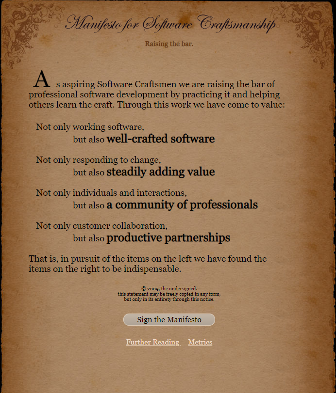

# 🚀 Chapter 7: 장인 정신

## 📚 애자일 후유증
- 애자일 전환 과정에서 많은 기업이 실제로 이득을 보았고, 기존보다는 훨씬 발전했지만, 그렇지 않은 회사들도 여전히 많다.
- 관리자가 개발자를 더 빠르게 일하도록 압박하려고 프로세스의 투명성을 활용하여 시시콜콜하게 관리하다.
- 제품 책임자가 보기에 개발자가 자동화된 테스트나 리팩터링, 짝 프로그래밍 등에 너무 많은 시간을 쓰고 있는 것 같으면, 팀 전체에 바로 그만두라고 말한다.
- 중요한 기술 활동은 이런 애자일 프로세스에서 찾아볼 수 없다. 위에서 떨어진 명령은 그저 백로그에서 가장 수선 순위가 높은 일에 집중하라는 것이다.
- 이 모든 문제를 막아주는 애자일을 도입하려던 꿈은 사라졌다. 관리자는 개발자가 일하는 게 느리다고 비난한다. 개발자는 관리자가 꼭 필요한 기술적인 작업을 하지 못하게 막는다고 비난한다.
- 제품 책임자는 자신의 팀의 일원으로 생각 하지 않고, 일이 잘못되었을 때 책임을 함께 지지도 않는다. 편 가르기 문화가 팽배해진다.
- 이것이 바로 애자일 후유증이다.

## 📚 서로 다른 기대
> 협업이 원활하게 이루어지면 일을 할 때 장애물이 다소 줄어들기는 하지만, 사람들에게 없던 기술을 만들어 주지는 않는다.

- 2주마다 소프트웨어를 제품으로 릴리스하려먼 많은 훈련과 기술 역량이 필요하다.
- ㅅ스템에 전반적인 안정성을 담보하면서 하루에 여러 번 소프트웨어를 서비스에 배포하려면, 기술적인 작업이나 엔지니어링에 대한 숙련도가 엄청나게 높아야 한다.
- 전략적인 사고가 필요하다. 동시에 여러 명이 작업을 할 수 있도록 모듈식 설계가 필요하다. 시스템을 언제나 서비스에 배포할 수 있도록 유지하면서 변경 사항을 계속 통합할 수 있어야 한다. 유연하면서도 튼튼한 소프트웨어를 지속적으로 만들어야 한다.
- 이렇게 하기 위해서는 이에 걸맞는 엔지니어링 기술이 뒷받침되어야 한다.

## 📚 떠나감
- 요즘 대부분의 애자일 코치는 기술 실천 방법을 가르칠 만한 기술 역량이 아예 없거나 부족하다. 그래서 엔지니어링 이야기는 거의 꺼내지도 않는다. 이런 상태가 계속되면서 개발자는 애자일 코치를 또 하나의 관리층으로 여기게 되었다.
- 일을 더 잘할 수 있게 도와주는 사람이 아니라 그냥 일을 시키는 사람으로 보는 것이다.

> 개발자가 애자일에서 떠나가는 것일까? 애자일이 개발자에게서 떠나가는 것일까?

- 제품 책임자나 제품 관리자는 여전히 팀의 일부라고 느끼지 못한다.
- 개발자는 지속적인 시스템 개발과 유지보수에 필요한 기술적 개선을 하기 위해 여전히 사업 부서와 힘든 협상을 해야만 한다.

> 기업은 아직도 기술적인 문제가 사실은 비즈니스 문제라는 것을 깨달을 만큼 성숙하지 못하다.

## 📚 소프트웨어 장인 정신
- 애자일 선언을 바탕으로 [새로운 선언](http://manifesto.softwarecraftsmanship.org/)을 만들어 발표했다.

> 미래의 소프트웨어 장인으로서 우리는 전문 소프트웨어 개발의 기준을 높이려 한다. 이를 위하여 높은 수준의 개발을 실천하고, 다른 사람이 기술을 배오는 것을 도울 것이다. 이 작업을 통하여 우리가 동이한 가치는 다음과 같다.
> 1. 작동하는 소프트웨어뿐 아니라, **잘 만들어진 소프트웨어**
> 2. 변화에 대응할 뿐 아니라, **꾸준히 가치를 더하기**
> 3. 개인과 상호작용뿐 아니라, **전문가 커뮤니티**
> 4. 고객과의 협력뿐 아니라, **생산적인 동반 관계**
>
> 왼쪽에 있는 것을 추구하다 보면, 오른쪽에 있는 것이 필요해진다는 것이다.

- **소프트웨어 장인 정신 선언**은 이념이나 사고방식을 다룬다.

#### 🦄 잘 만들어진 소프트웨어
- 잘 설계하고 테스트한 코드다.
- 변경하기가 두렵지 않고, 사업이 변화에 빠르게 반응할 수 있도록 만들어 주는 코드다.
- 유연하면서 튼튼한 코드다.

#### 🦄 꾸준히 가치를 더하기
- 우리가 무엇을 하는지 고객과 고용주에게 계속 더 많은 가치를 제공하는 데 집중해야 한다는 것이다.

#### 🦄 전문가 커뮤니티
- 지식을 나누고 서로 배우며 업계의 기준을 올려야 한다는 뜻이다.
- 우리는 다음 세대 개발자를 키워낼 책임이 있다.

#### 🦄 생산적인 동반 관계
- 고객 및 고용주와 전문가다운 괸계를 맺어야 한다는 뜻이다.
- 언제나 윤리적으로 공손하게 행동해야 한다.

---

- 네 가지 가치는 전문가적인 가치이기도 하지만 개인의 가치이기도 하다.
- 장인은 누군가가 돈을 지불해서가 아니라, 더 잘하고 싶은 스스로의 욕구를 바탕으로 최고의 결과물을 내기 위해 노력한다.

## 📚 이념 대 방법론
- 이념은 견해와 이상으로 만들어진 체계이다.
- 방법론은 방법과 실천 사항으로 이루어진 체계이다.
- 이념은 우리가 추구해야 할 이상을 알려 준다. 이 이상에 도달하기 위해서 여러ㅓ 방법론을 사용할 수 있다.
- 애자일의 주요 목표는 사업을 기민하게 만들고 고객을 만족시키는 것이다.
- 방법론이나 실천 사항에 너무 집중하면, 팀이나 조직이 진짜 목표에서 벗어나 버릴 수 있다.
- 방법론과 실천 사항은 목적을 위한 도구일뿐이기는 하지만, 하찮게 보아서는 안 된다.

## 📚 실천 방법이 아니라 가치에 집중하라
- 실천 방법을 논의할 때는 반드시 달성할 목표에 먼저 공감해야 한다.
- 예를 들어, TDD를 먼저 들이밀기 전에 전체 시스템을 테스트하기 위해 들이는 시간을 줄이는 일에 어떤 가치가 있는지 의견을 모아 보면 어떨까? 라는 질문으로 다다가야 한다.
- 다만 더 나은 대안 제시 없이 실천 방법을 거부하는 것은 용납할 수 없다.

## 📚 실천 방법 논의하기
- 실천 방법을 둘러싼 논의는 적절한 사람들과 적절한 수준에서 해야 한다.
- 개발자가 테스트를 쓰는 데 허락을 받으려 해서는 안 된다. 단위 테스트나 리팩터링 작업 일정을 따로 잡아서도 안 된다. 이런 기술적인 작업은 기능 개발 과정에서 이미 이루어졌어야 한다. (선택이 아니라 필수)
- **개발자와 사업 부서와의 대화에서도 왜, 무엇을, 언제까지인지만 논의해야지 어떻게를 다루어서는 안 된다.**

## 📚 장인 정신과 애자일
- 근본적으로 두 운동은 매우 비슷한 것을 이루려고 한다. 둘 모두 고객의 만족을 원하고, 둘 다 가깝게 협력하기를 바라며, 둘 다 짧은 피드백 고리를 중요시한다.
- 둘 다 높은 품질의 가치 있는 결과물을 만들기 원하고, 둘 다 작업의식을 윈한다.
- 애자일과 장인 정신을 조합하는 것이 가장 완벽한 방법이다.